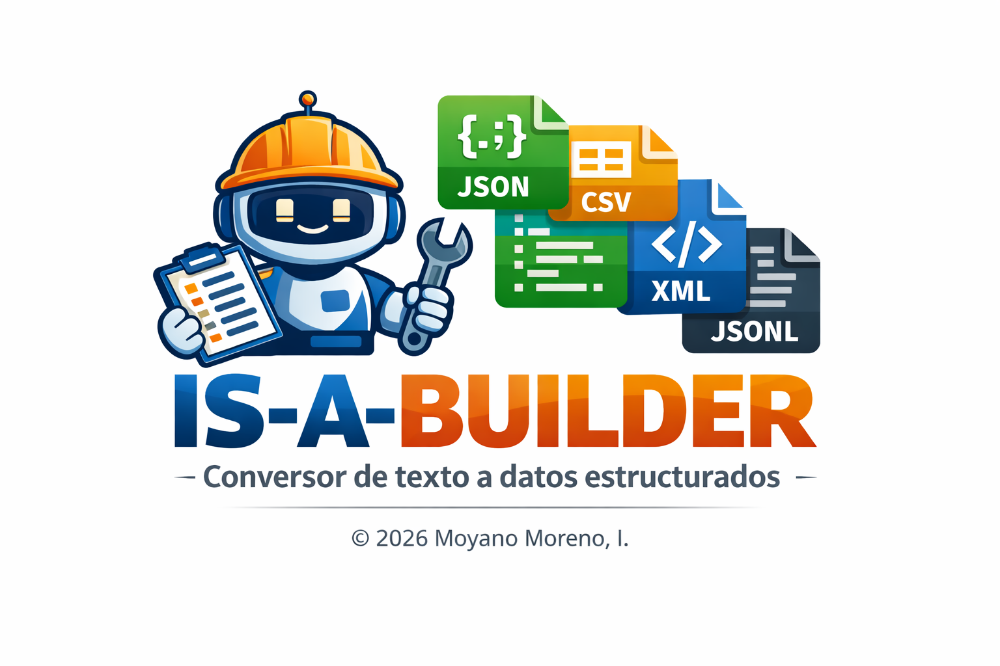

  

**IS-A-BUILDER** es una herramienta pedagógica diseñada para estudiantes e investigadores que se inician en el **Procesamiento del Lenguaje Natural (PLN)**. Su objetivo es facilitar la transición de archivos de texto plano (.txt) a formatos de datos estructurados e interoperables.

## 🚀 Funcionalidades
- **Opciones de carga:** Soporta subida de archivos `.txt` y entrada manual de texto (copy-paste).
- **Tokenización:** Segmentación automática de oraciones utilizando el tokenizador de NLTK.
- **Preprocesamiento:** Opciones para normalización a minúsculas y eliminación de la puntuación.
- **Métricas:** Conteo en tiempo real de ítems (filas), palabras y caracteres.
- **Exportación multi-formato:** Descarga de datasets en **JSON, JSONL, CSV y XML**.

## 🚀 Uso
Puedes utilizar **IS-A-BUILDER** de dos formas:

### 🌐 Uso en línea (recomendado)
Accede directamente a la herramienta desplegada:
👉 **[https://is-a-builder.streamlit.app](https://is-a-builder.streamlit.app)**

### 💻 Instalación y Uso Local
1. Clonar el repositorio.
2. Instalar dependencias: `pip install -r requirements.txt`.
3. Ejecutar la app: `streamlit run app.py`.

## 🎓 Cita Sugerida
Moyano Moreno, I. (2026). *IS-A-BUILDER: conversor de texto a datos estructurados* [Software]. 

---
Desarrollado con ❤️ por **Isabel Moyano Moreno** para mis alumnos y otros curiosos e interesados en el PLN.
